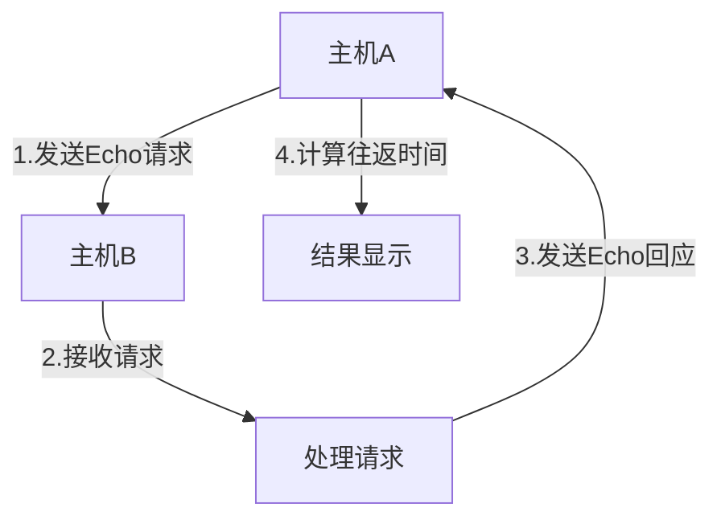
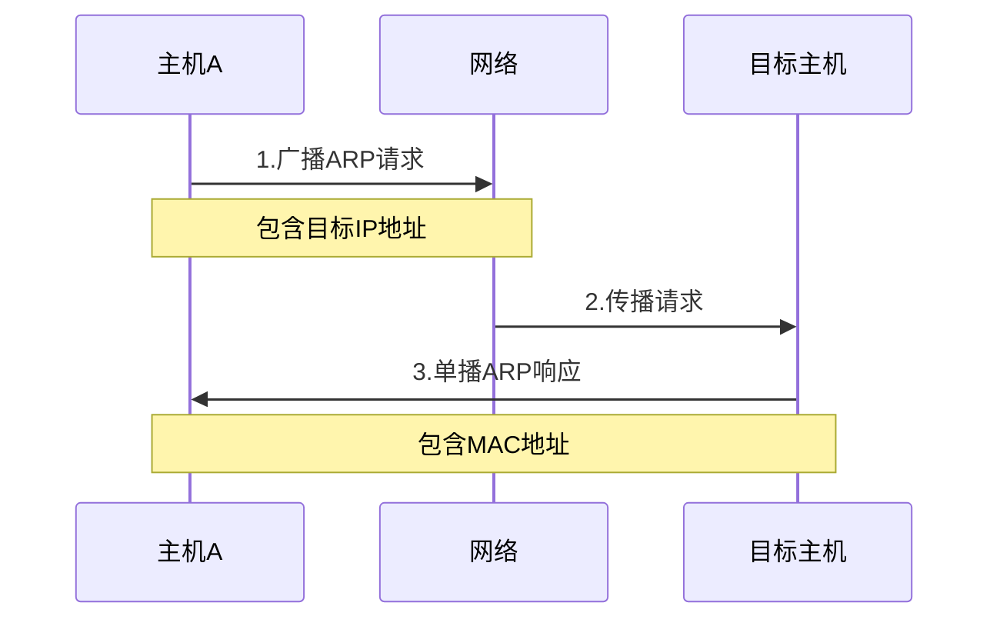
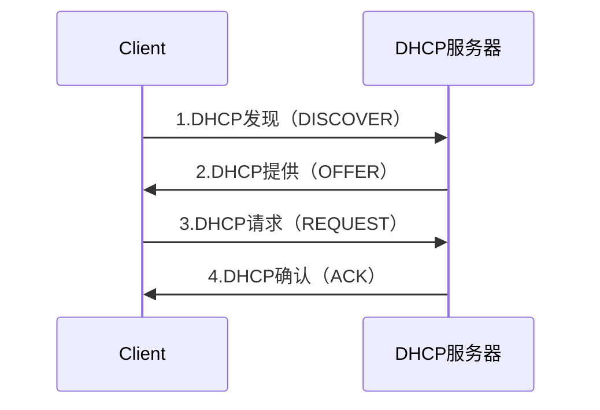
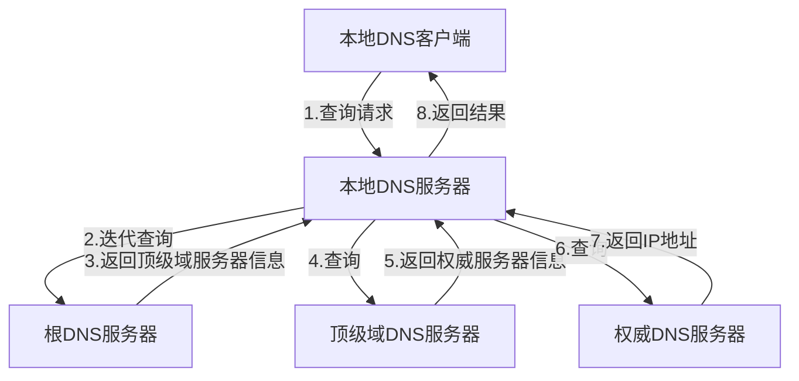
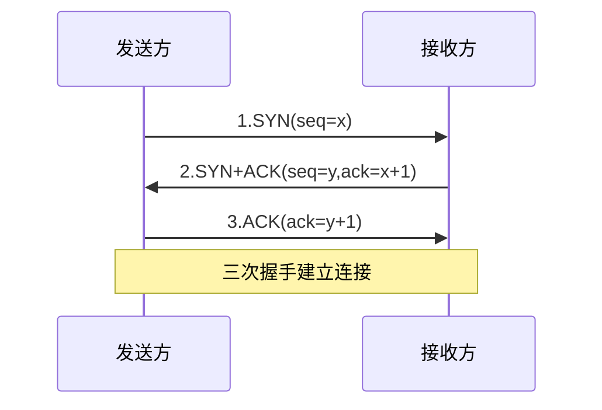
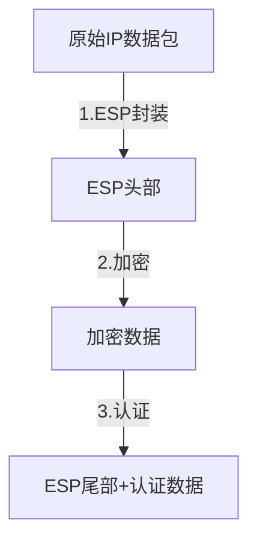
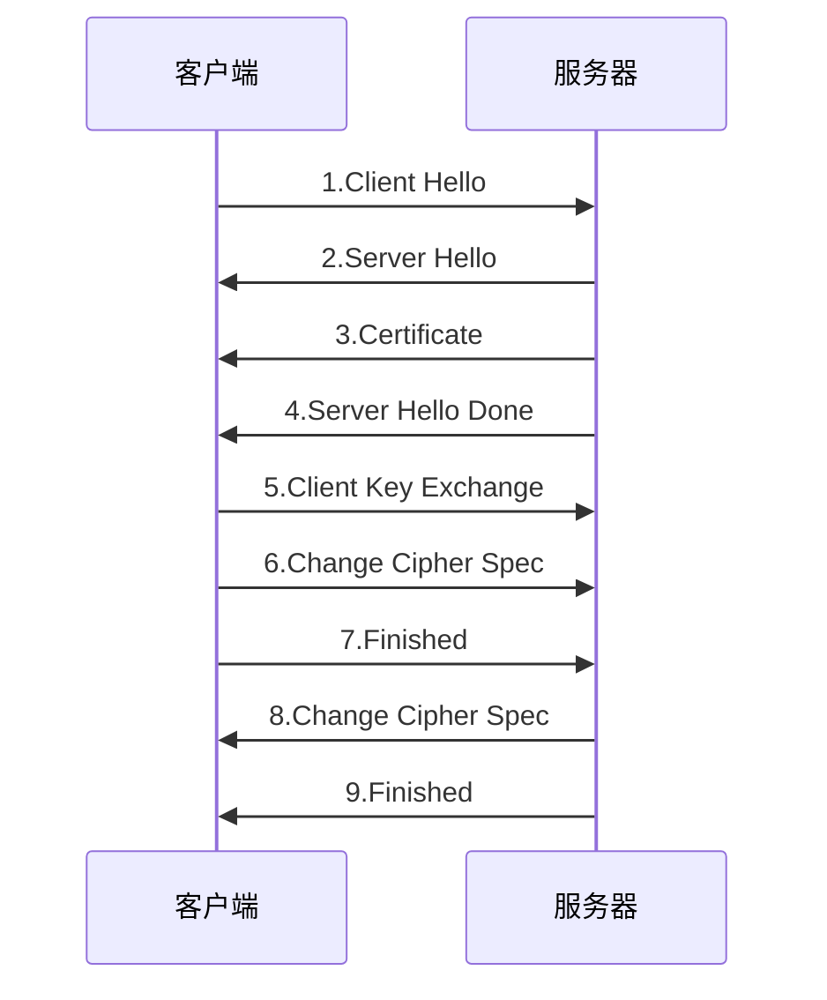
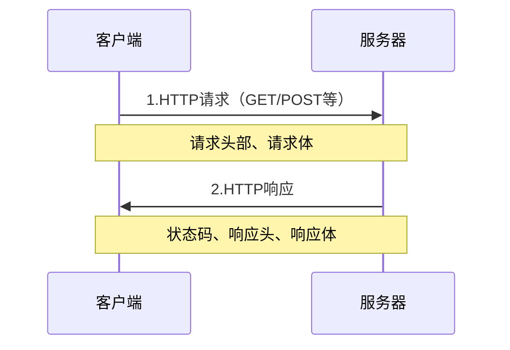
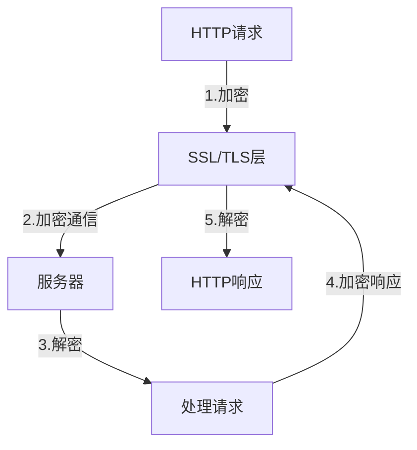
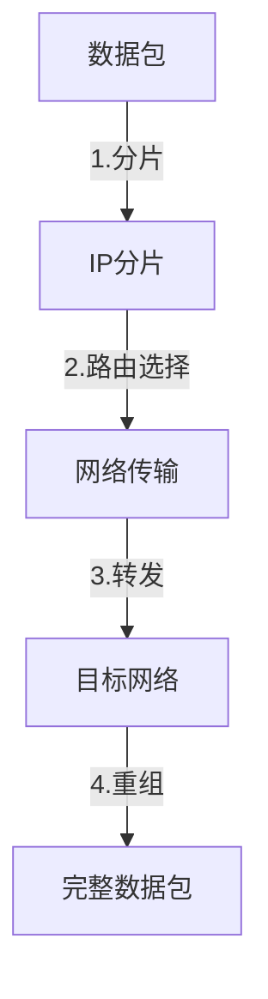

# 1 常见网络协议详解

## 1.1 网络层协议

### 1.1.1 ICMP（Internet Control Message Protocol）
- **概述**：互联网控制报文协议，用于在IP主机、路由器之间传递控制消息
- **主要功能**：
  - 差错报告
  - 网络探测
  - 状态查询



- **报文类型**：
  1. 差错报告报文
     - 目标不可达
     - 源抑制
     - 超时
     - 参数问题
  2. 询问报文
     - 回送请求和回答
     - 时间戳请求和回答

### 1.1.2 ARP（Address Resolution Protocol）
- **概述**：地址解析协议，用于将IP地址解析为MAC地址
- **工作原理**：



- **ARP缓存**：
  - 动态缓存：通过ARP请求获得
  - 静态缓存：手动配置
  - 缓存老化时间

### 1.1.3 DHCP（Dynamic Host Configuration Protocol）
- **概述**：动态主机配置协议，自动分配IP地址
- **工作流程**：



- **配置信息**：
  - IP地址
  - 子网掩码
  - 默认网关
  - DNS服务器
  - 租约时间

## 1.2 应用层协议

### 1.2.1 DNS（Domain Name System）
- **概述**：域名系统，将域名转换为IP地址
- **查询过程**：



- **记录类型**：
  - A记录：域名到IPv4地址
  - AAAA记录：域名到IPv6地址
  - CNAME记录：别名记录
  - MX记录：邮件交换记录
  - NS记录：域名服务器记录

### 1.2.2 SNMP（Simple Network Management Protocol）
- **概述**：简单网络管理协议，用于网络设备的监控和管理
- **架构**：


- **操作类型**：
  - Get：获取变量值
  - GetNext：获取下一个变量值
  - Set：设置变量值
  - Trap：主动通知

## 1.3 传输层协议

### 1.3.1 TCP（Transmission Control Protocol）[[TCP和UDP协议详解]]
- **概述**：传输控制协议，面向连接的可靠传输协议
- **特点**：
  - 面向连接
  - 可靠传输
  - 流量控制
  - 拥塞控制



### 1.3.2 UDP（User Datagram Protocol）
- **概述**：用户数据报协议，无连接的不可靠传输协议
- **特点**：
  - 无连接
  - 不可靠传输
  - 报文独立
  - 支持多播和广播

```mermaid
graph LR
    A[发送方] -->|数据报文| B[接收方]
    note over A,B: 无需建立连接即可传输数据
```

## 1.4 安全协议

### 1.4.1 IPSec
- **概述**：IP安全协议，提供网络层的安全服务
- **安全服务**：
  - 数据机密性
  - 数据完整性
  - 身份认证
  - 防重放



### 1.4.2 SSL/TLS
- **概述**：安全套接字层/传输层安全协议
- **握手过程**：



- **安全特性**：
  - 身份认证
  - 数据加密
  - 消息完整性
  - 会话管理

### 1.4.3 HTTP（Hypertext Transfer Protocol）
- **概述**：超文本传输协议，用于Web服务器与客户端之间的通信
- **特点**：
  - 无状态
  - 可扩展
  - 基于请求-响应模型
  - 支持多种数据类型



- **请求方法**：
  - GET：获取资源
  - POST：提交数据
  - PUT：更新资源
  - DELETE：删除资源
  - HEAD：获取报文头部

### 1.4.4 HTTPS（HTTP Secure）
- **概述**：HTTP的安全版本，通过SSL/TLS提供加密通信
- **工作原理**：



- **安全特性**：
  - 数据加密
  - 身份验证
  - 完整性校验
  - 防止中间人攻击

## 1.5 网络层协议

### 1.5.1 IP（Internet Protocol）
- **概述**：网际协议，负责数据包的寻址和路由
- **功能特点**：
  - 无连接服务
  - 尽最大努力交付
  - 数据报分片与重组
  - 地址管理



- **地址类型**：
  - IPv4：32位地址
  - IPv6：128位地址
- **报文格式**：
  - 版本号
  - 首部长度
  - 服务类型
  - 总长度
  - 标识
  - 生存时间
  - 协议
  - 首部校验和
  - 源地址
  - 目的地址
