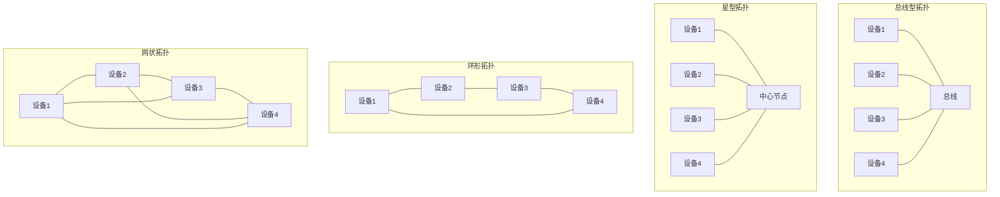
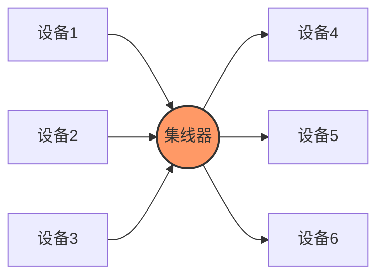
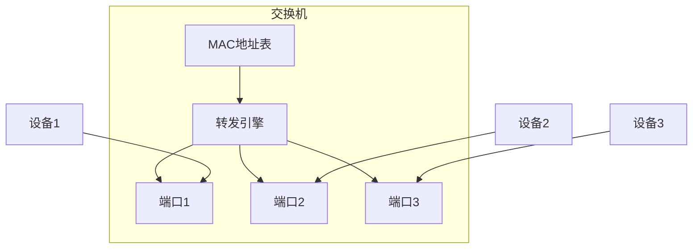
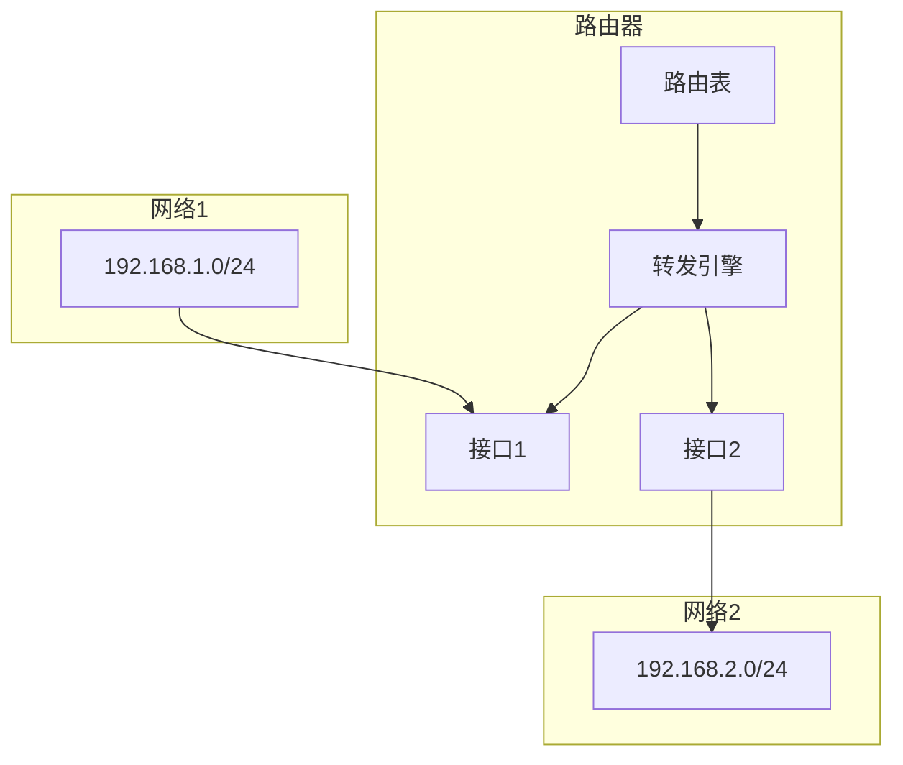

# 1 网络拓扑结构

==**常见网络拓扑**==

## 1.1 总线型拓扑

- **特点**：
  - 所有设备共享一条通信介质
  - 结构简单，易于实现
  - 故障诊断容易
- **缺点**：
  - 总线故障会影响整个网络
  - 网络性能受设备数量影响
  - 存在冲突域问题

## 1.2 星型拓扑

- **特点**：
  - 中心节点控制所有通信
  - 易于管理和维护
  - 故障隔离性好
- **缺点**：
  - 中心节点故障影响整个网络
  - 需要更多的布线
  - 成本较高

## 1.3 环形拓扑

- **特点**：
  - 数据单向传输
  - 无中心节点
  - 每个节点都是中继点
- **缺点**：
  - 单个节点故障影响整个网络
  - 故障定位困难
  - 网络延迟随节点增加而增加

## 1.4 网状拓扑

- **特点**：
  - 冗余链路提供高可靠性
  - 多路径传输
  - 负载均衡能力强
- **缺点**：
  - 实现复杂
  - 成本高
  - 维护困难

# 2 网络设备工作原理

## 2.1 集线器（Hub）

- **工作原理**：
  - 工作在物理层
  - 简单转发电信号
  - 广播方式工作
- **特点**：
  - 构成一个冲突域
  - 无数据过滤能力
  - 带宽被所有端口共享

## 2.2 交换机（Switch）

- **工作原理**：
  - 工作在数据链路层
  - 基于MAC地址转发
  - 维护MAC地址表
- **特点**：
  - 每个端口独立冲突域
  - 支持全双工通信
  - 具有学习能力

## 2.3 路由器（Router）

- **工作原理**：
  - 工作在网络层
  - 基于IP地址转发
  - 维护路由表
- **功能**：
  - 路由选择
  - 数据包过滤
  - 网络互联
- **特点**：
  - 隔离广播域
  - 支持多种路由协议
  - 提供网络安全功能

# 3 网络设备选择建议

## 3.1 小型网络

- **推荐设备**：
  - 交换机
  - 无线路由器
- **考虑因素**：
  - 成本效益
  - 易于管理
  - 基本安全需求

## 3.2 中型网络

- **推荐设备**：
  - 三层交换机
  - 企业级路由器
  - 防火墙
- **考虑因素**：
  - 网络分段
  - VLAN支持
  - 安全性要求

## 3.3 大型网络

- **推荐设备**：
  - 核心交换机
  - 高端路由器
  - 负载均衡器
  - 安全设备
- **考虑因素**：
  - 高可用性
  - 性能需求
  - 管理便利性
  - 扩展能力
