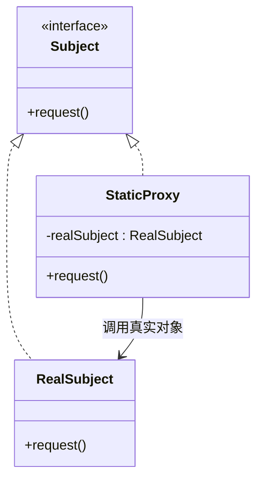
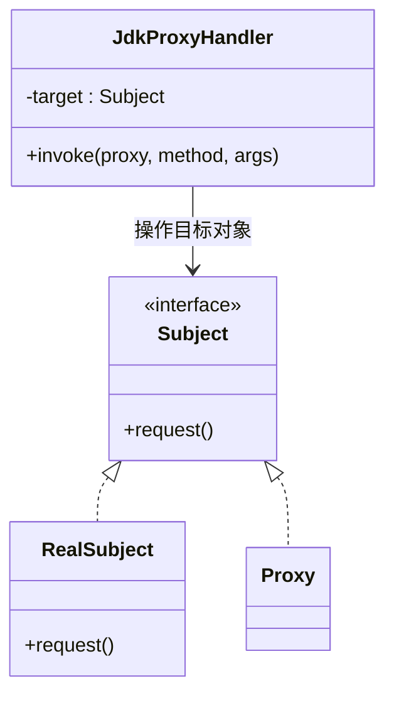
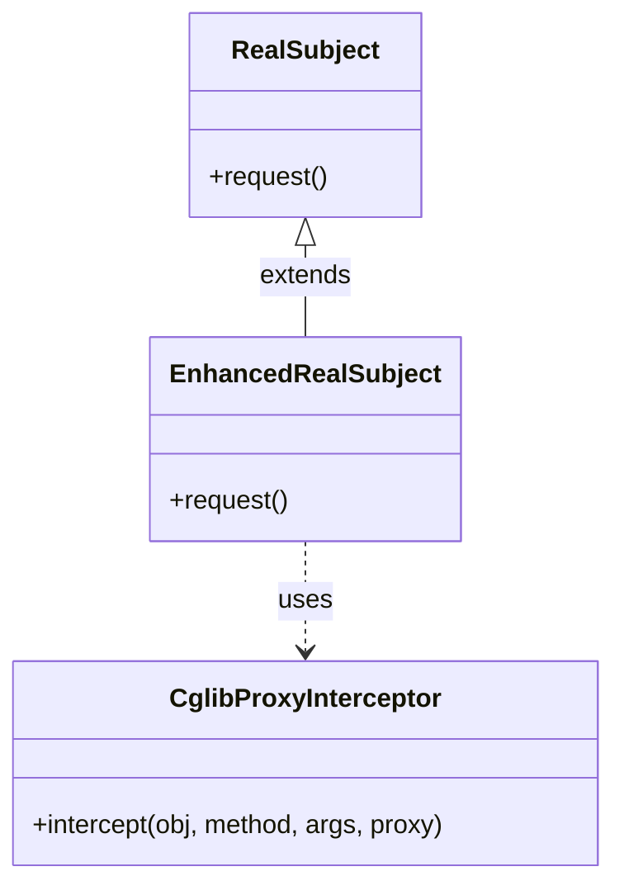
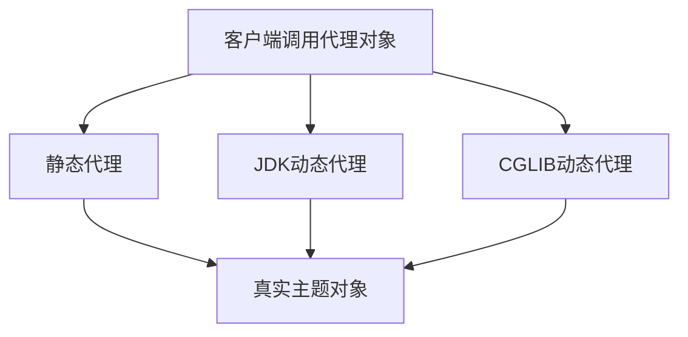

# 1 代理模式（Proxy Pattern）

## 1.1 概述

代理模式是一种结构型设计模式，它为其他对象提供一个代理以控制对这个对象的访问。代理对象在客户端和目标对象之间起到中介的作用，并可以在不改变目标对象的情况下添加额外的功能，例如访问控制、缓存、日志记录等。

## 1.2 使用场景

- 需要在访问一个对象时执行额外的操作（如权限控制、缓存、日志记录等）
- 需要对远程对象提供本地代理
- 需要延迟加载对象（虚拟代理）
- 需要保护原始对象的访问（保护代理）
- 需要智能引用，在没有客户端使用时释放对象

## 1.3 静态代理（Static Proxy）

静态代理通过在编译期间创建代理类来实现，其代理类与目标类实现相同的接口，每个方法调用中可以加入请求前处理或请求后处理逻辑。

**详细概念介绍（静态代理）：**
静态代理的原理是在程序编译期间就确定了代理类，该代理类实现了和真实主题类相同的接口。代理类在调用真实对象的方法时，可以在方法调用前后执行一些额外操作，例如日志记录、权限验证等。虽然这种方法实现简单，但当接口发生变化时，需要同步修改对应的代理类，可能导致代码冗余。



### 1.3.1 示例代码（静态代理）：

```java
// 抽象主题接口
interface Subject {
    void request();
}

// 真实主题类
class RealSubject implements Subject {
    @Override
    public void request() {
        System.out.println("RealSubject处理请求");
    }
}

// 静态代理类
class StaticProxy implements Subject {
    private RealSubject realSubject;

    @Override
    public void request() {
        // 请求前处理，例如权限检查或者日志记录
        preRequest();
        // 延迟实例化真实对象，控制访问
        if (realSubject == null) {
            realSubject = new RealSubject();
        }
        realSubject.request();
        // 请求后处理，例如统计响应时间
        postRequest();
    }

    private void preRequest() {
        System.out.println("StaticProxy在请求前的处理");
    }

    private void postRequest() {
        System.out.println("StaticProxy在请求后的处理");
    }
}

// 使用示例
class Client {
    public static void main(String[] args) {
        Subject subject = new StaticProxy();
        subject.request();
    }
}
```

## 1.4 动态代理（Dynamic Proxy）

动态代理是在运行时创建代理对象，无需提前编写代理类。常见的动态代理技术有 JDK 动态代理和 CGLIB 动态代理。

### 1.4.1 JDK 动态代理

**详细概念介绍（JDK 动态代理）：**
JDK 动态代理基于 Java 反射机制，在运行时动态生成代理对象。该代理对象实现了目标对象的接口，通过实现 InvocationHandler 接口，可以在方法调用前后插入自定义操作，如日志记录、安全检查等。优点是无需为每个接口编写代理类，可灵活地在运行时修改行为，但缺点在于目标类必须实现接口，否则无法使用 JDK 动态代理。



#### 1.4.1.1 示例代码（JDK 动态代理）：

```java
import java.lang.reflect.InvocationHandler;
import java.lang.reflect.Method;
import java.lang.reflect.Proxy;

// 抽象主题接口
interface Subject {
    void request();
}

// 真实主题类，实现Subject接口
class RealSubject implements Subject {
    @Override
    public void request() {
        System.out.println("RealSubject处理请求");
    }
}

// 动态代理处理器，实现InvocationHandler接口，负责拦截方法调用
class JdkProxyHandler implements InvocationHandler {
    // 被代理的目标对象
    private Object target;

    public JdkProxyHandler(Object target) {
        this.target = target;
    }

    // 拦截被代理对象的方法调用，加上前后处理逻辑
    @Override
    public Object invoke(Object proxy, Method method, Object[] args) throws Throwable {
        preRequest();
        Object result = method.invoke(target, args);
        postRequest();
        return result;
    }

    private void preRequest() {
        System.out.println("JdkProxy在请求前处理");
    }

    private void postRequest() {
        System.out.println("JdkProxy在请求后处理");
    }
}

// 使用示例
class JdkProxyClient {
    public static void main(String[] args) {
        RealSubject realSubject = new RealSubject();
        // 创建动态代理实例，代理对象实现了Subject接口
        Subject subjectProxy = (Subject) Proxy.newProxyInstance(
            realSubject.getClass().getClassLoader(),
            realSubject.getClass().getInterfaces(),
            new JdkProxyHandler(realSubject)
        );
        subjectProxy.request();
    }
}
```

### 1.4.2 CGLIB 动态代理

**详细概念介绍（CGLIB 动态代理）：**

CGLIB 动态代理采用继承的方式，在运行时为目标类生成一个子类，通过覆盖方法实现增强功能。这种方式不要求目标类实现接口，因此适用于没有接口的情况。通过实现 MethodInterceptor 接口，可以在方法调用前后添加自定义逻辑，如记录日志等。其缺点是需要额外依赖 cglib 库，并且不能对 final 类使用该技术。



#### 1.4.2.1 示例代码（CGLIB 动态代理）：

```java
import net.sf.cglib.proxy.Enhancer;
import net.sf.cglib.proxy.MethodInterceptor;
import net.sf.cglib.proxy.MethodProxy;
import java.lang.reflect.Method;

// 真实主题类（无需实现接口）
class RealSubject {
    public void request() {
        System.out.println("RealSubject处理请求");
    }
}

// 方法拦截器，实现MethodInterceptor接口，拦截目标方法调用
class CglibProxyInterceptor implements MethodInterceptor {
    @Override
    public Object intercept(Object obj, Method method, Object[] args, MethodProxy proxy) throws Throwable {
        preRequest();
        Object result = proxy.invokeSuper(obj, args);
        postRequest();
        return result;
    }

    private void preRequest() {
        System.out.println("CglibProxy在请求前处理");
    }

    private void postRequest() {
        System.out.println("CglibProxy在请求后处理");
    }
}

// 使用示例
class CglibProxyClient {
    public static void main(String[] args) {
        Enhancer enhancer = new Enhancer();
        // 设置需要代理的目标类
        enhancer.setSuperclass(RealSubject.class);
        // 设置回调方法拦截器
        enhancer.setCallback(new CglibProxyInterceptor());
        // 创建代理对象
        RealSubject proxySubject = (RealSubject) enhancer.create();
        proxySubject.request();
    }
}
```

## 1.5 代理模式的分类总结

1. 静态代理（Static Proxy）
   - 编译时确定代理代码，代码量相对较大，不易扩展
2. 动态代理（Dynamic Proxy）
   - JDK 动态代理：依赖接口实现，代理类在运行时生成，不需要额外编写代理类
   - CGLIB 动态代理：无需实现接口，通过继承的方式生成代理类，适用于没有接口的场景

## 1.6 优点

1. 降低系统耦合：代理模式协调调用者和被调用者，降低了直接依赖
2. 灵活性：可以在运行时动态决定是否调用目标对象，以及插入额外的处理逻辑
3. 可扩展性：在不修改目标类代码的情况下，追加额外的功能或逻辑

## 1.7 缺点

1. 性能开销：由于增加了一层代理，可能会导致请求处理速度变慢
2. 代码复杂性：在使用动态代理时，理解反射或者代码生成原理可能较复杂
3. 维护成本：代理层过多会增加系统复杂性和维护难度

## 1.8 适用场景及注意事项

1. 当需要控制对象访问，并在调用前后加入额外功能时，适合使用代理模式。
2. 动态代理尤其适用与面向切面编程（AOP）场景，如日志记录、事务管理、权限控制等。
3. 需要在权衡性能开销与维护复杂性之间做出合理选择。



