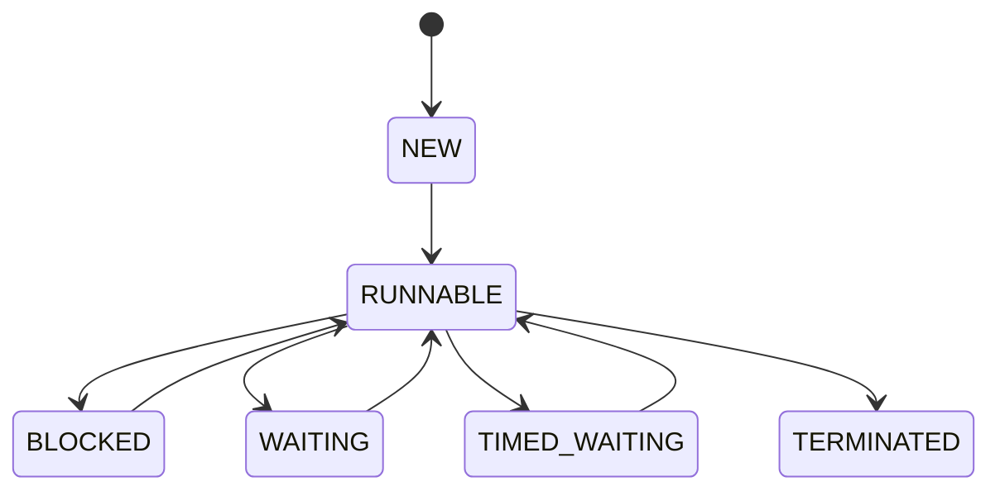

# 1 Java 开发工程师面试指南 📚

  

## 1.1 目录

  

- [一、Java 核心知识](#一java-核心知识)

- [二、框架技术](#二框架技术)

- [三、计算机网络](#三计算机网络)

- [四、分布式技术](#四分布式技术)

- [五、Linux 系统](#五linux-系统)

- [六、数据库优化](#六数据库优化)

- [七、系统设计](#七系统设计)

- [八、安全相关](#八安全相关)

- [九、算法准备](#九算法准备)

- [十、项目经验](#十项目经验)

- [面试准备计划](#面试准备计划)

  

## 1.2 一、Java 核心知识 💡

  

### 1.2.1 JVM 相关

  

#### 1.2.1.1 JVM 内存模型

  

- 内存区域划分

  - 程序计数器：线程私有，记录当前线程执行字节码的位置

  - 虚拟机栈：线程私有，存储局部变量表、操作数栈等

  - 本地方法栈：线程私有，为 Native 方法服务

  - 堆：线程共享，存储对象实例，GC 的主要区域

    - 新生代（Eden、Survivor）

    - 老年代

    - 大对象直接进入老年代的阈值设置

  - 方法区：线程共享，存储类信息、常量、静态变量等

    - JDK8 后的元空间（Metaspace）

    - 常量池的位置变化

- 实际案例准备

  - 解释 OOM 案例：堆内存溢出、栈溢出、元空间溢出

  - 内存泄漏案例：线程池使用不当、资源未释放

  - 性能优化案例：内存分配优化、GC 调优

  

#### 1.2.1.2 类加载机制

  

- 类加载过程

  - 加载：获取类的二进制字节流

  - 验证：确保字节流符合 JVM 规范

  - 准备：为静态变量分配内存并初始化默认值

  - 解析：符号引用转为直接引用

  - 初始化：执行 static 块，为静态变量赋值

- 双亲委派模型

  - Bootstrap ClassLoader

  - Extension ClassLoader

  - Application ClassLoader

  - 自定义 ClassLoader

- 破坏双亲委派

  - 为什么要破坏：SPI 机制、JDBC 为例

  - 如何破坏：重写 loadClass/findClass

  - 实际案例：Tomcat 类加载机制

- 面试准备重点

  - 讲解自己实现过的类加载器

  - SPI 机制的实际应用

  - 线上类加载问题排查经验

  

#### 1.2.1.3 垃圾回收机制

  

- GC 算法

  - 标记-清除：产生内存碎片

  - 复制算法：空间利用率低

  - 标记-整理：效率较低

  - 分代收集：新生代复制，老年代标记-整理

- 垃圾收集器

  - Serial：单线程收集器

  - ParNew：多线程收集器

  - CMS：并发标记清除

    - 初始标记（STW）

    - 并发标记

    - 重新标记（STW）

    - 并发清除

  - G1：区域化分代式

    - Region 划分

    - 停顿预测模型

    - Mixed GC

  - ZGC：低延迟垃圾收集器

- GC 调优实践

  - 常用参数配置

    - 堆大小设置

    - 新生代与老年代比例

    - GC 日志配置

  - 调优目标

    - 降低 Full GC 频率

    - 减少 GC 停顿时间

    - 提高吞吐量

  - 调优步骤

    - 确定目标

    - 收集数据

    - 分析问题

    - 调整参数

    - 验证效果

  - 实际案例

    - CMS 并发模式失败案例

    - G1 回收器调优经验

    - ZGC 使用场景

  

#### 1.2.1.4 JVM 调优参数

  

- 内存相关

  - -Xms：初始堆大小

  - -Xmx：最大堆大小

  - -Xmn：新生代大小

  - -XX:MetaspaceSize：元空间初始大小

  - -XX:MaxMetaspaceSize：元空间最大大小

- GC 相关

  - -XX:+UseG1GC：使用 G1 收集器

  - -XX:MaxGCPauseMillis：最大 GC 停顿时间

  - -XX:ParallelGCThreads：GC 线程数

- 日志相关

  - -XX:+PrintGCDetails：打印 GC 详细信息

  - -XX:+PrintGCDateStamps：打印 GC 时间戳

  - -Xloggc：GC 日志文件路径

- 实战经验

  - 不同场景的参数配置

  - 参数调优的实际效果

  - 线上问题排查案例

  

#### 1.2.1.5 OOM 问题排查

  

- 常见 OOM 类型

  - java.lang.OutOfMemoryError: Java heap space

  - java.lang.OutOfMemoryError: GC overhead limit exceeded

  - java.lang.OutOfMemoryError: Direct buffer memory

  - java.lang.OutOfMemoryError: unable to create new native thread

  - java.lang.OutOfMemoryError: Metaspace

- 排查工具

  - jmap：堆内存快照

  - jstack：线程栈信息

  - jstat：GC 统计信息

  - arthas：在线诊断工具

  - MAT：内存分析工具

- 排查步骤

  1. 获取堆内存快照

  2. 分析对象分布

  3. 查看 GC 日志

  4. 分析线程栈

  5. 定位代码问题

- 实际案例分析

  - 内存泄漏案例

  - 线程创建过多案例

  - 直接内存溢出案例

- 预防措施

  - 设置合理的内存大小

  - 代码规范检查

  - 监控告警机制

  - 压测评估

  

### 1.2.2 Java 并发编程 ⚡

  

#### 1.2.2.1 线程基础

  

- 线程生命周期

  - NEW：创建但未启动

  - RUNNABLE：可运行状态

  - BLOCKED：阻塞状态

  - WAITING：等待状态

  - TIMED_WAITING：超时等待

  - TERMINATED：终止状态

  

  

- 线程创建方式

  - 继承 Thread 类

  - 实现 Runnable 接口

  - 实现 Callable 接口（有返回值）

  - 线程池方式

- 线程通信方式

  - volatile 关键字

  - synchronized 关键字

  - wait/notify 机制

  - CountDownLatch

  - CyclicBarrier

  - Semaphore

- 实战要点

  - 线程状态监控

  - 线程安全问题排查

  - 死锁检测与预防

  

#### 1.2.2.2 线程池

  

- 核心参数

  - corePoolSize：核心线程数

  - maximumPoolSize：最大线程数

  - keepAliveTime：线程存活时间

  - workQueue：工作队列

  - threadFactory：线程工厂

  - handler：拒绝策略

- 工作原理

  - 线程创建策略

  - 任务提交流程

  - 线程复用机制

  - 任务队列管理

- 常用线程池

  - FixedThreadPool

  - CachedThreadPool

  - ScheduledThreadPool

  - SingleThreadExecutor

- 实际应用

  - 线程池参数配置最佳实践

  - 动态调整线程池参数

  - 线程池监控指标

  

#### 1.2.2.3 锁机制

  

- synchronized

  - 对象锁和类锁

  - 锁升级过程

    - 偏向锁

    - 轻量级锁

    - 重量级锁

  - 同步原理

  - 优化手段

- ReentrantLock

  - 可重入性

  - 公平锁/非公平锁

  - 条件变量（Condition）

  - 可中断特性

- 读写锁

  - ReentrantReadWriteLock

  - StampedLock

- 实战经验

  - 锁优化实践

  - 死锁问题排查

  - 性能对比分析

  

#### 1.2.2.4 AQS 原理

  

- 核心思想

  - 状态变量 state

  - CLH 队列

  - 独占/共享模式

- 实现原理

  - 同步队列管理

  - 等待队列管理

  - 条件队列实现

- 常见应用

  - ReentrantLock

  - Semaphore

  - CountDownLatch

  - CyclicBarrier

- 源码分析

  - acquire 流程

  - release 流程

  - 条件队列实现

  

#### 1.2.2.5 并发容器

  

- ConcurrentHashMap

  - JDK7 vs JDK8 实现

  - 分段锁设计

  - 扩容机制

  - 并发度优化

- BlockingQueue

  - ArrayBlockingQueue

  - LinkedBlockingQueue

  - DelayQueue

  - PriorityBlockingQueue

- CopyOnWriteArrayList

  - 写时复制机制

  - 适用场景

  - 性能特点

- 实战应用

  - 场景选择

  - 性能优化

  - 常见坑点

  

#### 1.2.2.6 ThreadLocal

  

- 基本原理

  - ThreadLocalMap 结构

  - 弱引用机制

  - 内存模型

- 常见问题

  - 内存泄漏

  - 脏数据

  - 父子线程传值

- 最佳实践

  - 使用场景

  - 注意事项

  - 性能优化

- 实战案例

  - 用户上下文传递

  - 数据库连接管理

  - 事务传播

  

### 1.2.3 Java 核心知识

  

#### 1.2.3.1 集合框架

  

##### 1.2.3.1.1 HashMap 源码分析

  

- 数据结构

  - 数组 + 链表 + 红黑树

  - 链表转红黑树阈值（8）

  - 红黑树转链表阈值（6）

  - 初始容量和加载因子

- 核心方法实现

  - put 流程

    - hash 计算

    - 数组扩容

    - 树化过程

  - get 流程

  - resize 机制

    - 扩容条件

    - 数据迁移

    - 并发问题

- 重要特性

  - 线程不安全性

  - 有序性

  - null 键值

  - 扩容机制

- 实战经验

  - 容量设置

  - 线程安全方案

  - 性能优化

  

##### 1.2.3.1.2 ArrayList 源码分析

  

- 实现原理

  - 动态数组

  - 默认容量

  - 扩容机制

- 核心方法

  - add/remove 实现

  - 扩容过程

  - 迭代器实现

- 性能特点

  - 随机访问

  - 插入删除

  - 内存占用

- 实战考虑

  - 初始容量设置

  - 批量操作优化

  - 遍历方式选择

  

#### 1.2.3.2 Stream API

  

- 实现原理

  - 惰性求值

  - 中间操作

  - 终止操作

  - 并行流实现

- 常用操作

  - filter/map/reduce

  - collect 收集器

  - flatMap 使用

  - peek 调试

- 高级特性

  - 自定义 Collector

  - 并行流优化

  - 短路操作

  - 状态操作

- 最佳实践

  - 性能考虑

  - 并行流使用场景

  - 常见陷阱

  

#### 1.2.3.3 Lambda 表达式

  

- 基本概念

  - 函数式接口

  - 方法引用

  - 变量捕获

  - 作用域

- 实现原理

  - 字节码生成

  - 性能开销

  - 内部类对比

- 常见应用

  - 集合操作

  - 并发编程

  - 事件处理

  - 策略模式

- 使用建议

  - 可读性平衡

  - 异常处理

  - 调试技巧

  

#### 1.2.3.4 反射机制

  

- 核心概念

  - Class 对象

  - Constructor 对象

  - Method 对象

  - Field 对象

- 实现原理

  - 类加载机制

  - 动态代理

  - 反射调用流程

- 性能优化

  - 缓存优化

  - setAccessible

  - 方法句柄

  - 反射开销

- 应用场景

  - 框架开发

  - 动态代理

  - 泛型擦除

  - 注解处理

  

#### 1.2.3.5 注解原理

  

- 基础知识

  - 元注解

  - 注解保留策略

  - 注解继承

  - 注解处理器

- 运行机制

  - 编译时处理

  - 运行时处理

  - 字节码增强

- 实现原理

  - 反射获取

  - 代理模式

  - AOP 实现

- 实战应用

  - 自定义注解

  - 配置管理

  - 权限控制

  - 参数校验

  

#### 1.2.3.6 IO/NIO

  

##### 1.2.3.6.1 IO 模型

  

- BIO（阻塞 IO）

  - 实现原理

  - 适用场景

  - 性能特点

- NIO（非阻塞 IO）

  - Buffer（缓冲区）

  - Channel（通道）

  - Selector（选择器）

  - 零拷贝实现

- AIO（异步 IO）

  - 实现机制

  - 回调模型

  - 完成事件

  

##### 1.2.3.6.2 核心组件

  

- Buffer

  - 类型与特点

  - 核心属性

  - 常用方法

  - 内存映射

- Channel

  - 文件通道

  - 套接字通道

  - 数据报通道

  - Pipe

- Selector

  - 事件类型

  - 注册机制

  - 多路复用

  

##### 1.2.3.6.3 实战应用

  

- 文件操作

  - 大文件处理

  - 断点续传

  - 文件加锁

- 网络编程

  - 服务器实现

  - 客户端实现

  - 性能优化

- 最佳实践

  - 模型选择

  - 资源管理

  - 异常处理

  - 性能调优

  

## 1.3 二、框架技术（重点）

  

### 1.3.1 Spring 全家桶

  

#### 1.3.1.1 Spring IOC

  

- 容器初始化

  - BeanDefinition 加载

  - Bean 实例化过程

  - 依赖注入过程

- Bean 生命周期

  - 实例化

  - 属性赋值

  - 初始化

  - 销毁

- 循环依赖解决

  - 三级缓存原理

  - 提前暴露对象

  - AOP 代理对象创建

- 实战要点

  - 自定义 scope

  - Bean 加载优化

  - 性能调优

  

#### 1.3.1.2 Spring AOP

  

- 实现原理

  - JDK 动态代理

  - CGLIB 代理

  - 代理选择策略

- 核心概念

  - 切面（Aspect）

  - 切点（Pointcut）

  - 通知（Advice）

  - 连接点（JoinPoint）

- 应用场景

  - 事务管理

  - 日志记录

  - 权限控制

  - 性能监控

- 最佳实践

  - 代理模式选择

  - 切点表达式优化

  - 性能考虑

  

#### 1.3.1.3 Spring 事务

  

- 事务传播行为

  - REQUIRED

  - REQUIRES_NEW

  - NESTED

  - SUPPORTS

  - NOT_SUPPORTED

  - NEVER

  - MANDATORY

- 事务隔离级别

  - 脏读

  - 不可重复读

  - 幻读

  - 实现机制

- 事务实现原理

  - 声明式事务

  - 编程式事务

  - AOP 实现原理

- 实战经验

  - 事务失效场景

  - 事务优化策略

  - 分布式事务处理

  

### 1.3.2 Web 开发

  

- Servlet 技术

  - Servlet 生命周期

  - Filter 和 Listener

  - Session 和 Cookie

- Spring MVC

  - 请求处理流程

  - 参数绑定

  - 拦截器机制

  - 异常处理

- RESTful API

  - REST 设计原则

  - 接口版本控制

  - 安全性考虑

  - 性能优化

  

### 1.3.3 ORM 框架

  

#### 1.3.3.1 MyBatis 工作原理

  

- 核心组件

  

  - Configuration：全局配置信息

  - SqlSessionFactory：会话工厂

  - SqlSession：SQL 会话

  - Executor：执行器

  - StatementHandler：语句处理器

  - ParameterHandler：参数处理器

  - ResultSetHandler：结果集处理器

  

- 工作流程

  

  - 配置文件解析

    - XML 解析过程

    - 注解解析过程

    - 动态 SQL 解析

  - SQL 执行过程

    - 参数映射

    - SQL 解析

    - 执行器选择

    - 结果映射

  - 插件机制

    - 拦截器原理

    - 插件配置

    - 自定义插件

  

- 动态 SQL

  - if/where/set

  - choose/when/otherwise

  - foreach/trim

  - bind 标签使用

  - OGNL 表达式

  

#### 1.3.3.2 MyBatis 缓存机制

  

- 一级缓存

  

  - Session 级别缓存

  - 工作原理

  - 缓存失效场景

  - 性能影响

  

- 二级缓存

  

  - 命名空间级别缓存

  - 缓存配置

    - eviction：清除策略

    - flushInterval：刷新间隔

    - size：引用数目

    - readOnly：只读属性

  - 缓存实现

    - 序列化机制

    - 自定义缓存

  - 使用建议

    - 适用场景

    - 注意事项

    - 性能考虑

  

- 自定义缓存

  - Redis 集成

  - EhCache 使用

  - 分布式缓存实现

  - 缓存同步策略

  

#### 1.3.3.3 MyBatis Plus 核心功能

  

- CRUD 增强

  

  - 通用 CRUD

  - 条件构造器

  - 主键策略

  - 逻辑删除

  

- 代码生成器

  

  - 表字段映射

  - 模板引擎

  - 自定义配置

  - 多数据源支持

  

- 插件机制

  

  - 分页插件

    - 物理分页

    - 多数据库支持

    - Count SQL 优化

  - 乐观锁插件

    - 版本号机制

    - 冲突处理

  - 动态表名

    - 分表实现

    - 租户隔离

  - SQL 性能分析

    - 执行时间监控

    - 慢查询日志

  

- 数据权限

  

  - 注解方式

  - 自动填充

  - 多租户支持

  - 数据加密

  

- 实战经验

  - 性能优化实践

    - SQL 优化

    - 批量操作

    - 缓存使用

  - 代码规范建议

    - 命名规范

    - 注解使用

    - 异常处理

  - 常见问题解决

    - 循环依赖

    - 事务处理

    - 分页性能

  

#### 1.3.3.4 实战案例

  

- 分页查询优化

  

  - 物理分页实现

  - 计数优化

  - 排序处理

  - 大数据量处理

  

- 批量操作处理

  

  - 批量插入优化

  - 批量更新策略

  - 事务控制

  - 异常处理

  

- 多数据源管理

  - 动态数据源切换

  - 分库分表支持

  - 读写分离实现

  - 事务处理

  

## 1.4 三、计算机网络

  

### 1.4.1 网络分层模型

  

#### 1.4.1.1 五层协议

  

- 应用层

  - HTTP/HTTPS

  - FTP

  - SMTP

  - DNS

  - WebSocket

- 传输层

  - TCP

  - UDP

  - 端口号

- 网络层

  - IP

  - ICMP

  - ARP

  - 路由协议

- 数据链路层

  - MAC 地址

  - 以太网协议

  - 交换机工作原理

- 物理层

  - 网络介质

  - 信号传输

  - 编码解码

  

#### 1.4.1.2 TCP/IP 详解

  

- TCP 协议详解

  

  - 连接管理

    - 三次握手过程

      - SYN、SYN-ACK、ACK 详解

      - 半连接队列和全连接队列

      - SYN Flood 攻击防范

    - 四次挥手过程

      - FIN、ACK 交互过程

      - TIME_WAIT 状态作用

      - CLOSE_WAIT 状态处理

  - 可靠传输机制

    - 序列号和确认号

    - 超时重传机制

    - 快速重传和快速恢复

    - 滑动窗口机制

      - 流量控制

      - 拥塞控制

  - 性能优化

    - TCP 缓冲区调优

    - 长连接和短连接选择

    - Nagle 算法

    - 延迟确认

  - 实战案例

    - TCP 连接异常排查

    - 网络性能优化实践

    - 高并发场景优化

  

- HTTP 协议

  

  - HTTP/1.1 特性

    - 持久连接

    - 管道化请求

    - 分块传输编码

    - 缓存机制

  - HTTP/2 改进

    - 多路复用

    - 服务器推送

    - 头部压缩

    - 二进制分帧

  - HTTP/3 特性

    - QUIC 协议

    - 0-RTT 建连

    - 多路复用优化

    - 更好的丢包恢复

  - 安全机制

    - HTTPS 原理

    - TLS 握手过程

    - 证书验证

    - 常见攻击防范

  

- 网络架构

  - 负载均衡

    - 四层负载均衡

    - 七层负载均衡

    - 负载均衡算法

    - 会话保持机制

  - CDN 技术

    - 工作原理

    - 缓存策略

    - 回源机制

    - 动态加速

  - 网络安全

    - DDOS 防护

    - WAF 配置

    - VPN 技术

    - 流量清洗

  - 网络监控

    - 链路监控

    - 流量分析

    - 故障诊断

    - 性能优化

  

### 1.4.2 网络编程

  

#### 1.4.2.1 IO 模型

  

- BIO（阻塞 IO）

  - 实现原理

  - 适用场景

  - 性能特点

- NIO（非阻塞 IO）

  - Buffer（缓冲区）

  - Channel（通道）

  - Selector（选择器）

  - 零拷贝实现

- AIO（异步 IO）

  - 实现机制

  - 回调模型

  - 完成事件

  

#### 1.4.2.2 网络安全

  

- Web 安全

  - XSS 攻击防范

    - 输入过滤

    - 输出转义

    - CSP 策略

  - CSRF 防护

    - Token 验证

    - Referer 检查

    - SameSite Cookie

  - SQL 注入预防

    - 参数化查询

    - ORM 框架

    - 输入验证

  - 文件上传漏洞

    - 文件类型校验

    - 文件内容检测

    - 存储路径限制

- 安全架构

  - 认证机制

    - Session 认证

    - Token 认证

    - OAuth2.0

    - JWT

  - 授权机制

    - RBAC 模型

    - 权限粒度控制

    - 动态权限

  - 加密算法

    - 对称加密

    - 非对称加密

    - 哈希算法

  - 安全传输

    - HTTPS

    - SSL/TLS

    - 证书管理

- 安全实践

  - 安全编码规范

  - 漏洞扫描

  - 渗透测试

  - 应急响应

  

## 1.5 四、分布式技术（高频）

  

### 1.5.1 分布式理论

  

- CAP 理论

  - 一致性（Consistency）

  - 可用性（Availability）

  - 分区容错性（Partition tolerance）

- BASE 理论

  - 基本可用（Basically Available）

  - 软状态（Soft state）

  - 最终一致性（Eventually consistent）

- 分布式事务

  - 2PC

  - 3PC

  - TCC

  - SAGA

- 一致性算法

  - Paxos

  - Raft

  - ZAB

  

### 1.5.2 分布式服务

  

- 服务注册与发现

- 负载均衡

- 服务熔断

- 服务降级

- 服务限流

- 分布式锁

- 分布式缓存

- 分布式会话

  

### 1.5.3 分库分表

  

#### 1.5.3.1 分库分表策略

  

- 拆分方式

  

  - 垂直拆分

    - 按业务拆分数据库

    - 按表拆分到不同库

    - 优缺点分析

  - 水平拆分

    - 按数据量拆分

    - 按时间拆分

    - 按范围拆分

  - 混合拆分

    - 先垂直后水平

    - 实际应用案例

  

- 分片策略

  

  - 范围分片

    - 按 ID 范围分片

    - 按时间范围分片

    - 动态扩容方案

  - Hash 分片

    - 取模分片

    - 一致性 Hash

    - 虚拟节点

  - 组合分片

    - 多字段分片

    - 复合策略

    - 动态分片

  

- 数据路由

  - 路由算法

    - 直接取模

    - 范围路由

    - 一致性哈希

  - 路由规则

    - 分片键选择

    - 路由策略配置

    - 路由缓存

  

#### 1.5.3.2 ShardingSphere 实践

  

- 核心功能

  

  - 数据分片

    - 分片策略配置

    - 分片算法实现

    - 分布式主键

  - 读写分离

    - 主从配置

    - 负载均衡

    - 故障转移

  - 分布式事务

    - XA 事务

    - BASE 事务

    - Seata 集成

  

- 配置实践

  

  - 分片规则

    - 分片表配置

    - 分片算法定义

    - 分片策略选择

  - 读写分离

    - 数据源配置

    - 负载均衡策略

    - 主从同步延迟

  - 数据加密

    - 加密算法

    - 加密字段

    - 查询优化

  

- 性能优化

  - SQL 优化

    - 路由优化

    - 聚合优化

    - 分页优化

  - 连接池优化

    - 连接池配置

    - 监控指标

    - 异常处理

  - 执行引擎优化

    - 并行执行

    - 内存优化

    - 流量控制

  

#### 1.5.3.3 分布式主键生成

  

- UUID 方案

  

  - 标准 UUID

    - 实现原理

    - 性能特点

    - 存储影响

  - 改进版 UUID

    - 有序 UUID

    - 压缩 UUID

    - 自定义格式

  

- 雪花算法

  

  - 原理详解

    - 时间戳部分

    - 工作机器 ID

    - 序列号

  - 实现方案

    - 标准实现

    - 改进方案

    - 时钟回拨处理

  - 性能优化

    - ID 池化

    - 批量生成

    - 并发优化

  

- 数据库序列

  - MySQL 自增

    - 自增步长

    - 自增配置

    - 主从同步

  - 序列表方案

    - 号段模式

    - 动态步长

    - 预分配机制

  

#### 1.5.3.4 实战经验

  

- 容量规划

  

  - 数据量评估

  - 分片数量确定

  - 扩容时机判断

  - 性能指标设定

  

- 扩容方案

  

  - 在线扩容

    - 双写方案

    - 数据迁移

    - 流量切换

  - 停机扩容

    - 数据导出

    - 数据校验

    - 系统升级

  

- 常见问题处理

  - 数据一致性

    - 分布式事务

    - 数据校验

    - 修复方案

  - 跨库查询

    - 查询优化

    - 结果合并

    - 性能优化

  - 运维管理

    - 监控告警

    - 故障处理

    - 容灾备份

  

### 1.5.4 Redis 深入

  

#### 1.5.4.1 数据结构与实现

  

- 基础数据类型

  - String：SDS 实现

  - Hash：压缩列表/字典

  - List：双向链表/压缩列表

  - Set：整数集合/字典

  - Sorted Set：压缩列表/跳表

- 底层编码

  - 编码转换规则

  - 内存优化策略

  - 性能影响

- 实战应用

  - 缓存设计

  - 分布式锁

  - 计数器实现

  - 排行榜设计

  

#### 1.5.4.2 持久化机制

  

- RDB

  - 触发机制

  - 执行流程

  - fork 优化

  - 最佳配置

- AOF

  - 写入机制

  - 重写机制

  - fsync 策略

  - 混合持久化

- 实践经验

  - 持久化策略选择

  - 性能优化

  - 故障恢复

  

#### 1.5.4.3 集群方案

  

- 主从复制

  - 复制原理

  - 断点续传

  - 心跳检测

- 哨兵机制

  - 监控机制

  - 故障转移

  - 选举机制

- Cluster 模式

  - 数据分片

  - 故障转移

  - 一致性保证

- 实战案例

  - 大规模集群部署

  - 监控告警

  - 扩容方案

  

### 1.5.5 消息队列

  

- [ ] 消息模型

- [ ] 消息可靠性投递

- [ ] 死信队列

- [ ] 消息幂等性处理

  

## 1.6 五、Linux 系统

  

### 1.6.1 Linux 常用命令

  

- 文件操作

  - ls、cd、pwd

  - cp、mv、rm

  - touch、mkdir

  - chmod、chown

  - find、grep

- 文本处理

  - cat、more、less

  - head、tail

  - sed、awk

  - vim 编辑器

- 系统监控

  - top、htop

  - ps、kill

  - free、df

  - netstat、ifconfig

  - iostat、vmstat

- 网络工具

  - ping、telnet

  - curl、wget

  - scp、ssh

  - tcpdump、wireshark

- 包管理

  - apt、yum

  - rpm、dpkg

  - tar、zip

  

### 1.6.2 系统管理

  

#### 1.6.2.1 进程管理

  

- 进程概念

  - 进程状态

  - 进程调度

  - 进程通信

  - 守护进程

- 进程监控

  - top 命令详解

  - ps 命令使用

  - 进程优先级调整

  - OOM 机制

- 实战经验

  - 进程异常排查

  - 性能问题定位

  - 资源限制配置

  - 进程管理最佳实践

  

#### 1.6.2.2 内存管理

  

- 内存架构

  - 物理内存

  - 虚拟内存

  - 页面置换

  - 交换空间

- 内存监控

  - free 命令

  - vmstat 命令

  - 内存泄漏检测

  - 内存碎片处理

- 性能优化

  - 内存参数调优

  - 缓存管理

  - Swap 优化

  - 大页内存应用

  

#### 1.6.2.3 文件系统

  

- 文件系统类型

  - ext4

  - xfs

  - btrfs

  - tmpfs

- 文件操作

  - 文件权限

  - 软硬链接

  - inode 管理

  - 文件描述符

- 性能优化

  - IO 调度器选择

  - 文件系统参数调优

  - 磁盘性能优化

  - 文件系统监控

  

### 1.6.3 看门狗机制

  

- 概念与原理

  - 硬件看门狗

  - 软件看门狗

  - 监控指标

- 实现方式

  - 心跳检测

  - 进程监控

  - 服务监控

- 故障处理

  - 自动重启

  - 故障转移

  - 告警通知

- 最佳实践

  - 超时设置

  - 监控粒度

  - 恢复策略

  

## 1.7 六、数据库优化

  

### 1.7.1 MySQL 性能优化

  

#### 1.7.1.1 索引优化

  

- 索引原理

  - B+树结构

  - 聚簇索引

  - 二级索引

  - 索引覆盖

- 索引设计

  - 最左前缀原则

  - 索引选择性

  - 联合索引策略

- 执行计划分析

  - type 类型

  - key 选择

  - rows 估算

  - Extra 信息

- 实战优化

  - 索引失效场景

  - 索引优化案例

  - 性能监控指标

  

#### 1.7.1.2 SQL 优化

  

- 查询优化

  - WHERE 条件优化

  - JOIN 优化

  - 子查询优化

  - 排序优化

- 数据库设计

  - 表结构优化

  - 字段类型选择

  - 范式与反范式

- 性能监控

  - 慢查询日志

  - Performance Schema

  - MySQL Workbench

- 调优实践

  - 参数配置优化

  - 查询重写

  - 分页优化

  

#### 1.7.1.3 事务与锁优化

  

- 事务优化

  - 事务拆分

  - 事务超时设置

  - 死锁处理

- 锁优化

  - 锁粒度选择

  - 间隙锁控制

  - 锁等待优化

- 并发控制

  - MVCC 机制

  - 锁监控

  - 死锁检测

- 最佳实践

  - 大事务处理

  - 锁争用优化

  - 并发度控制

  

### 1.7.2 分库分表

  

- [ ] 分库分表策略

- [ ] ShardingSphere 使用经验

- [ ] 分布式主键生成

  

## 1.8 七、系统设计

  

### 1.8.1 设计模式

  

- 项目中使用的设计模式

  - 策略模式：AI 平台适配

  - 工厂模式：对象创建

  - 代理模式：AOP 实现

  - 观察者模式：事件通知

  - 建造者模式：对象构建

  

### 1.8.2 架构设计

  

- 分布式架构

  - 服务拆分原则

  - 接口设计规范

  - 数据一致性

  - 高可用设计

  

## 1.9 八、安全相关

  

### 1.9.1 Web 安全

  

- XSS 攻击防范

- CSRF 防护

- SQL 注入预防

- 文件上传漏洞

- 权限控制

- 加密算法

- 安全框架

  

## 1.10 九、算法准备

  

### 1.10.1 常见数据结构

  

- ArrayList/LinkedList 实现原理

- HashMap/ConcurrentHashMap 源码

- 树结构（二叉树、红黑树）

- 堆（优先队列实现）

  

### 1.10.2 算法思想

  

- 动态规划：最优解问题

- 回溯算法：组合问题

- 贪心算法：局部最优

- 双指针：查找、排序

  

## 1.11 十、项目经验（重点准备）

  

### 1.11.1 IntelliFlow AI 智能对话平台

  

#### 1.11.1.1 项目概述

  

- 项目背景：基于人工智能的智能对话平台，提供智能化的对话和工作支持

- 技术架构：前后端分离，Spring Boot + Vue 3

- 核心功能：智能对话、实时通信、文件管理、用户认证

  

#### 1.11.1.2 技术难点与解决方案

  

##### 1.11.1.2.1 WebSocket 长连接优化

  

- 问题：大量并发连接导致服务器压力大

- 解决方案：

  - 心跳机制维护连接状态

  - 连接池管理

  - 消息队列削峰

  - 分布式 Session 管理

  

##### 1.11.1.2.2 多 AI 平台集成

  

- 设计模式：策略模式 + 工厂模式

- 统一接口封装

- 动态配置管理

- 异常处理机制

  

##### 1.11.1.2.3 文件存储系统

  

- MinIO 对象存储

- 文件分片上传

- 断点续传实现

- 文件安全控制

  

#### 1.11.1.3 性能优化实践

  

- JVM 调优：内存分配、GC 参数配置

- 数据库优化：索引设计、SQL 优化

- 缓存策略：多级缓存、缓存预热

- 并发处理：线程池配置、异步处理

  

### 1.11.2 SQL Father 代码生成平台

  

#### 1.11.2.1 项目概述

  

- 定位：企业级 SQL 和代码生成工具

- 架构：Spring Boot + MyBatis Plus + Vue 3

- 特点：可视化建表、多数据源支持、智能导入导出

  

#### 1.11.2.2 核心功能实现

  

##### 1.11.2.2.1 可扩展架构设计

  

- 插件化架构

- 模板引擎设计

- 自定义验证器

- 动态数据源

  

##### 1.11.2.2.2 智能生成引擎

  

- 词库管理

- 智能字段推荐

- 索引优化建议

- 代码模板定制

  

##### 1.11.2.2.3 数据库版本控制

  

- Schema 版本管理

- 回滚机制

- 变更记录追踪

- 多环境同步

  

面试重点提示：

  

1. 项目经验要准备充分的案例和数据支撑

2. 技术原理要结合实际应用场景

3. 性能优化要有具体的优化指标

4. 准备一些技术难点的解决方案

5. 注意表达的逻辑性和条理性

6. 对于分布式、高并发等重点问题要有深入理解

7. 注重基础知识的掌握和实践经验的积累

  

# 2 天面试准备计划

  

## 2.1 Day 1（1 月 31 日）- Java 核心（上）

  

- 上午：JVM 内存模型、类加载机制

- 下午：垃圾回收机制、JVM 调优参数

- 晚上：OOM 问题排查、实战案例复习

  

## 2.2 Day 2（2 月 1 日）- Java 核心（下）

  

- 上午：Java 并发编程（线程基础、线程池）

- 下午：锁机制、AQS 原理

- 晚上：并发容器、ThreadLocal

  

## 2.3 Day 3（2 月 2 日）- Java 集合与特性

  

- 上午：集合框架（HashMap、ArrayList 源码）

- 下午：Stream API、Lambda 表达式

- 晚上：反射机制、注解原理、IO/NIO

  

## 2.4 Day 4（2 月 3 日）- Spring 全家桶

  

- 上午：Spring IOC、Spring AOP

- 下午：Spring 事务、Spring MVC

- 晚上：实战案例复习

  

## 2.5 Day 5（2 月 5 日）- ORM 与数据库（上）

  

- 上午：MyBatis 工作原理、缓存机制

- 下午：MyBatis Plus、MySQL 索引优化

- 晚上：SQL 优化、事务与锁

  

## 2.6 Day 6（2 月 6 日）- 分布式技术（上）

  

- 上午：分布式理论（CAP、BASE）

- 下午：分布式服务、分布式事务

- 晚上：分库分表实战

  

## 2.7 Day 7（2 月 7 日）- 分布式技术（下）

  

- 上午：Redis 核心原理与实践

- 下午：消息队列、分布式缓存

- 晚上：实战案例复习

  

## 2.8 Day 8（2 月 8 日）- 计算机网络与系统

  

- 上午：网络分层模型、TCP/IP 协议

- 下午：HTTP 协议、网络安全

- 晚上：Linux 常用命令与系统管理

  

## 2.9 Day 9（2 月 9 日）- 系统设计与实战

  

- 上午：设计模式、架构设计

- 下午：项目难点分析、解决方案

- 晚上：性能优化实践

  

## 2.10 Day 10（2 月 10 日）- 综合复习

  

- 上午：查漏补缺、重点回顾

- 下午：面试常见问题演练

- 晚上：简历优化、面试技巧

  

每日学习建议：

  

8. 📌 每个知识点结合实际案例

9. 📝 整理重点面试题

10. 📚 做好笔记和总结

11. 💻 准备相关代码示例

12. 🗣️ 模拟面试问答
